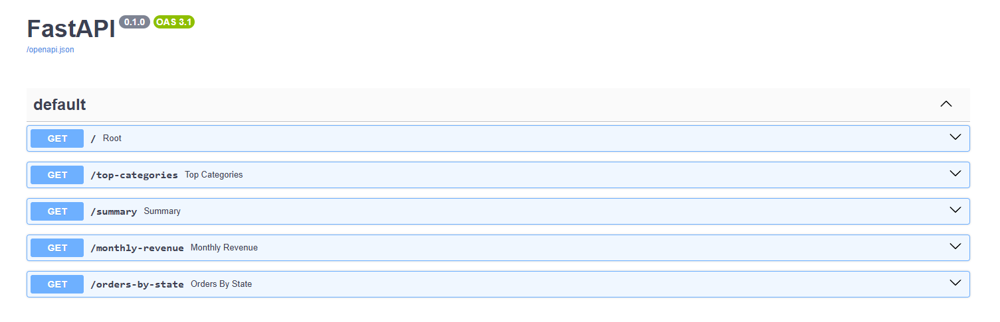
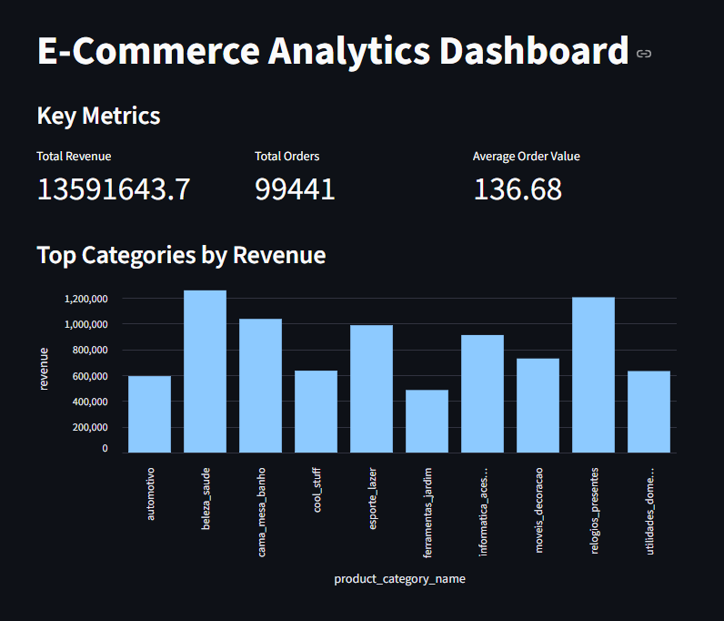
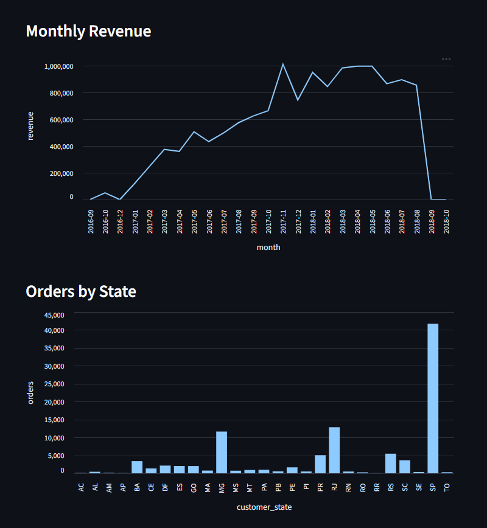

# E-Commerce Analytics Platform

A Dockerized data engineering and analytics platform built with Python, PostgreSQL, FastAPI, Streamlit, and GitHub Actions.

The project demonstrates a complete data pipeline from raw e-commerce data to interactive analytics dashboards and REST API endpoints.

## Tech Stack

- Python
- Pandas
- PostgreSQL
- SQLAlchemy
- FastAPI
- Streamlit
- Docker
- Docker Compose
- Git
- GitHub Actions
- Pytest

## Features

- ETL pipeline for e-commerce data
- PostgreSQL database
- REST API with FastAPI
- Interactive Streamlit dashboard
- Integration tests with PostgreSQL
- Dockerized application
- Automated API tests
- GitHub Actions CI

## Architecture

```text
Raw CSV
   │
   ▼
ETL Pipeline
   │
   ▼
PostgreSQL
   │
   ▼
FastAPI
   │
   ▼
Streamlit Dashboard
```

## Project Structure

```text
ecommerce-analytics-platform/
│
├── api/
├── dashboard/
├── database/
├── data/
├── etl/
├── tests/
├── .github/
├── Dockerfile
├── Dockerfile.dashboard
├── docker-compose.yml
└── README.md
```

## Installation

```bash
git clone <repository>

cd ecommerce-analytics-platform

docker compose up --build
```

After the containers have started:

Dashboard:
```text
http://127.0.0.1:8501
```

FastAPI Docs:
```text
http://127.0.0.1:8000/docs
```


## API Endpoints

| Endpoint | Beschreibung |
|----------|--------------|
| `/` | API status |
| `/summary` | KPI summary |
| `/top-categories` | Top product categories |
| `/monthly-revenue` | Monthly revenue |
| `/orders-by-state` | Orders grouped by state |

## API Documentation



## Dashboard

The Streamlit dashboard provides interactive analytics including:

- Revenue KPIs
- Monthly revenue trends
- Top product categories
- Orders by customer state

## Dashboard Preview





## Running Tests

```md
## Running Tests
```

```bash
python -m pytest tests
```
